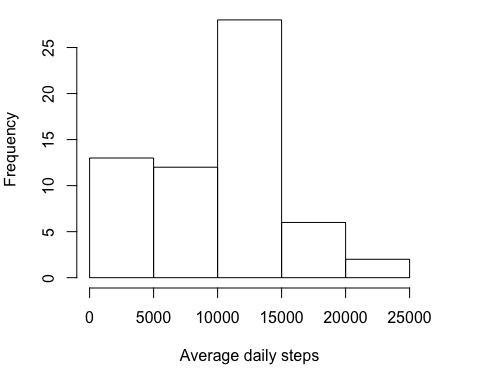
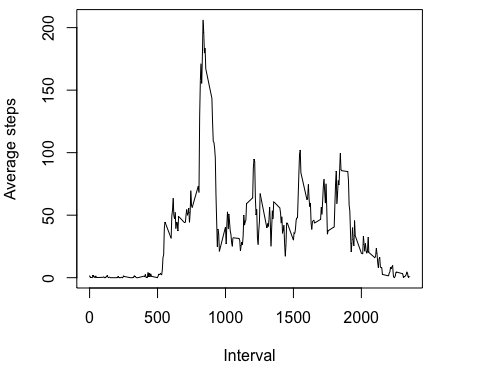
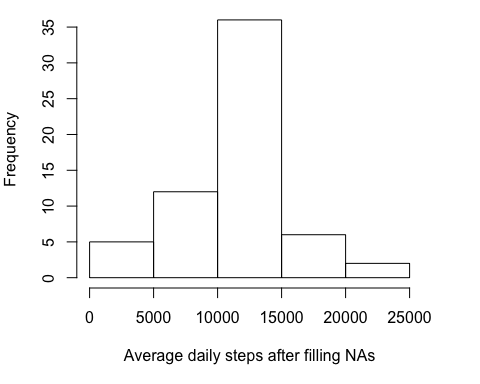
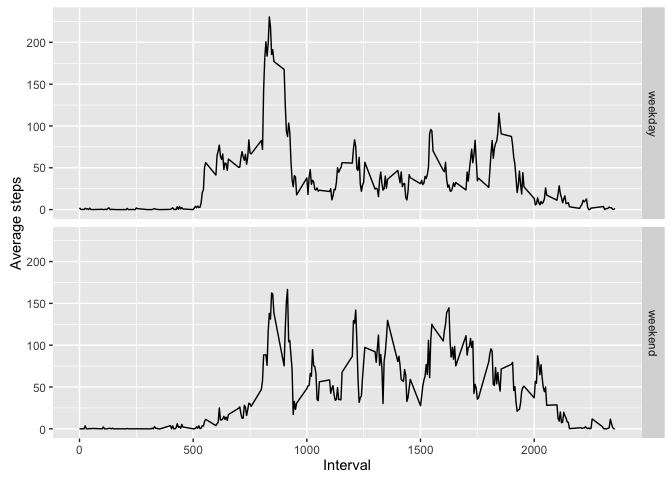

# Reproducible Research - Course Project 1
Yingxin Cao  
June 3, 2016  


## Loading and preprocessing the data

Read data from csv file (make sure it's in current working directory).

```r
d <- read.csv("activity.csv")
```

## What is mean total number of steps taken per day?

Make a histogram of the total number of steps taken each day.

```r
byday <- tapply(d$steps, d$date, sum, na.rm = TRUE)
par(mar = c(5, 4, 0.5, 3))
hist(byday, xlab = "Average daily steps", main = NA)
```

<!-- -->

Calculate and report the mean and median total number of steps taken per day.

```r
mean(byday)
```

```
## [1] 9354.23
```

```r
median(byday)
```

```
## [1] 10395
```

## What is the average daily activity pattern?

Make a time series plot (i.e. type = "l") of the 5-minute interval (x-axis) and the average number of steps taken, averaged across all days (y-axis).

```r
byinterval <- tapply(d$steps, d$interval, mean, na.rm = TRUE)
par(mar = c(5, 4, 0.5, 3))
plot(unique(d$interval), byinterval, type = "l", 
     xlab = "Interval", ylab = "Average steps")
```

<!-- -->

Which 5-minute interval, on average across all the days in the dataset, contains the maximum number of steps?

```r
unique(d$interval)[order(byinterval, decreasing = TRUE)[1]]
```

```
## [1] 835
```

## Imputing missing values

Calculate and report the total number of missing values in the dataset (i.e. the total number of rows with NAs).

```r
rowsWithNA <- nrow(d) - sum(complete.cases(d))
rowsWithNA
```

```
## [1] 2304
```

Create a new dataset that is equal to the original dataset but with the missing data filled in. Use the mean for that 5-minute interval to replace NAs. 


```r
d1 <- d
d1[, "interval_mean"] <- as.integer(rep(byinterval, times = 61))
for(i in 1:nrow(d1)){
    if(is.na(d1[i,1])){
        d1[i,1] <- d1[i,4]
    }
}
```

Make a histogram of the total number of steps taken each day and Calculate and report the mean and median total number of steps taken per day. 


```r
byday1 <- tapply(d1$steps, d1$date, sum, na.rm = TRUE)
par(mar = c(5, 4, 0.5, 3))
hist(byday1, xlab = "Average daily steps after filling NAs", main = NA)
```

<!-- -->

```r
mean(byday1)
```

```
## [1] 10749.77
```

```r
median(byday1)
```

```
## [1] 10641
```

Do these values differ from the estimates from the first part of the assignment? What is the impact of imputing missing data on the estimates of the total daily number of steps?
  
1. Mean and median daily steps are higher. Probably because mean for the 5-minute interval is used to replace NAs. 
2. Also daily steps falling in 0~5000 range is obviously decreased.

## Are there differences in activity patterns between weekdays and weekends?

Create a new factor variable in the dataset with two levels -- "weekday" and "weekend" indicating whether a given date is a weekday or weekend day.

```r
weekends <- c("Saturday", "Sunday")
d1$day <- apply(d1, 1, function(row) {
    if(weekdays(as.Date(row[2])) %in% weekends) "weekend" 
    else "weekday"})
d1$day <- as.factor(d1$day)
```

Make a panel plot containing a time series plot (i.e. type = "l") of the 5-minute interval (x-axis) and the average number of steps taken, averaged across all weekday days or weekend days (y-axis). 

```r
library(ggplot2)
wds <- d1[d1$day == "weekday", ]
wes <- d1[d1$day == "weekend", ]
bywds <- tapply(wds$steps, wds$interval, mean, na.rm = TRUE)
bywes <- tapply(wes$steps, wes$interval, mean, na.rm = TRUE)
sum <- data.frame(interval = rep(unique(d1$interval), times = 2), 
                  average = c(bywds, bywes), 
                  day = rep(unique(d1$day), each = 288))
g <- ggplot(sum, aes(sum$interval, sum$average))
g + geom_line() + facet_grid(day ~ .) + labs(x = "Interval", y = "Average steps")
```

<!-- -->
